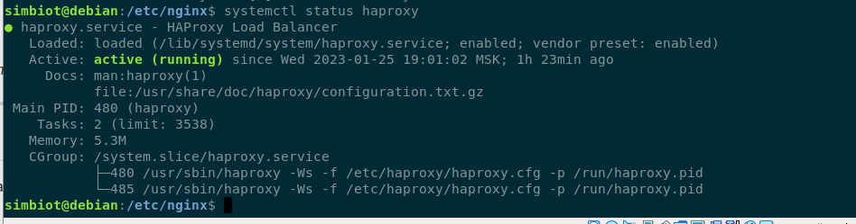
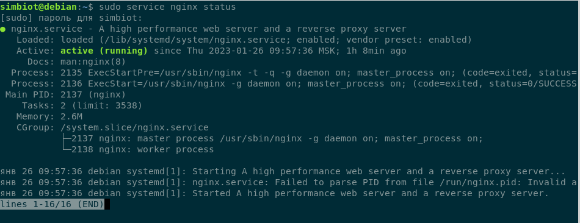
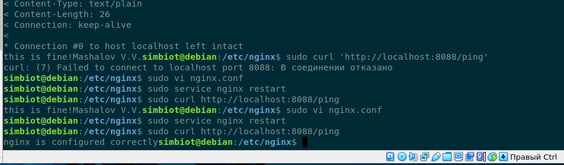

# Домашнее задание к занятию "`10.5 «Балансировка нагрузки `" - `Mashalov V.V.`
### Задание 1
```
Что такое балансировка нагрузки и зачем она нужна?

Приведите ответ в свободной форме.
```

> Балансировщик нагрузки — это сервис, который занимается распределением нагрузки между приложениями, которые находятся за ним, стараясь максимизировать скорость и утилизировать ресурсы приложений.  
Также, гарантирует, что приложения не будут перегружены.
>> Преимущества балансировки нагрузки:
>> + сокращение времени простоя;
>> + масштабируемость; 
>> + отказоустойчивость.
---
### Задание 2
```
Чем отличаются алгоритмы балансировки Round Robin и Weighted Round Robin? В каких случаях каждый из них лучше применять?

Приведите ответ в свободной форме.
```

> В Round Robin запросы отправляются на пул серверов последовательно , как будто наши сервера одинаковой мощности.  
> В Weighted Round Robin уже идет распределение запросов согласно мощности каждого сервера из пула.
>> :exclamation: Соответственно если у нас пул состоит из одинаковых серверов по мощности, то хорошо подойдет Round Robin, если разные мощности, то Weighted Round Robin.
---

### Задание 3
```
Установите и запустите Haproxy.

Приведите скриншот systemctl status haproxy, где будет видно, что Haproxy запущен.
```


---

### Задание 4
```
Установите и запустите Nginx.

Приведите скриншот systemctl status nginx, где будет видно, что Nginx запущен.
```


---
### Задание 5
```
Настройте Nginx на виртуальной машине таким образом, чтобы при запросе:

curl http://localhost:8088/ping

он возвращал в ответе строчку:

"nginx is configured correctly".

Приведите конфигурации настроенного Nginx сервиса и скриншот результата выполнения команды curl http://localhost:8088/ping.
```
---
```
user www-data;
worker_processes auto;
pid /run/nginx.pid;
include /etc/nginx/modules-enabled/*.conf;

events {}

http { # контекст(блочная директива)
 server {
listen 8088; # простая директива
 location /ping {
 return 200 'nginx is configured correctly';
 }
 }
}
```
